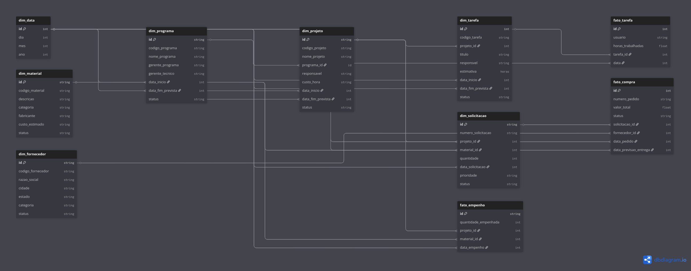

# Data Warehouse

## Visão Geral

Esta documentação apresenta a arquitetura e estrutura do Data Warehouse (DW) utilizado no projeto.

## Diagrama da Arquitetura



## Componentes Principais

### Camada de Origem (Source)
- Arquivos CSV

### Camada de Integração (Integration)
- ETL (Extract, Transform, Load)
- Data cleaning e validação
- Staging area

### Camada de Armazenamento (Storage)
- Fact tables
- Dimension tables
- Data marts

### Camada de Apresentação (Presentation)
- Business Intelligence
- Relatórios analíticos
- Dashboards

## Fluxo de Dados

1. Extração de dados das fontes
2. Transformação e limpeza
3. Carregamento no banco de dados
4. Consumo pelas APIs

## Modelo Dimensional

### Estrutura Geral
- **Dimensões**: `dim_data`, `dim_projeto`, `dim_programa`, `dim_tarefa`, `dim_solicitacao`, `dim_material`, `dim_fornecedor`
- **Fatos**: `fato_tarefa`, `fato_empenho`, `fato_compra`

### Fonte do Diagrama (DBML)

```dbml
// dimensões

Table dim_data {
	id int pk
	dia int
	mes int
	ano int
}

Table dim_projeto {
	id string [pk]
	codigo_projeto string
	nome_projeto string
	programa_id id [ref: > dim_programa.id]
	responsavel string
	custo_hora string
	data_inicio int [ref: > dim_data.id]
	data_fim_prevista int [ref: > dim_data.id]
	status string
}

Table dim_programa {
	id string [pk]
	codigo_programa string
	nome_programa string
	gerente_programa string
	gerente_tecnico string
	data_inicio int [ref: > dim_data.id]
	data_fim_prevista int [ref: > dim_data.id]
	status string
}

Table dim_tarefa {
	id int pk
	codigo_tarefa string
	projeto_id int [ref: > dim_projeto.id]
	titulo string
	responsvel string
	estimativa horas
	data_inicio int [ref: > dim_data.id]
	data_fim_prevista int [ref: > dim_data.id]
	status string
}

Table dim_solicitacao {
	id string [pk]
	numero_solicitacao string
	projeto_id string
	material_id string
	quantidade string
	data_solicitacao string
	prioridade string
	status string
}

Table dim_material {
	id string [pk]
	codigo_material string
	descricao string
	categoria string
	fabricante string
	custo_estimado string
	status string
}

Table dim_fornecedor {
	id string [pk]
	codigo_fornecedor string
	razao_social string
	cidade string
	estado string
	categoria string
	status string
}

// tarefa

Table fato_tarefa {
	id int pk
	usuario string
	horas_trabalhadas float
	tarefa_id int [ref: > dim_tarefa.id]
	data int [ref: > dim_data.id]
}

// material empenhado

Table fato_empenho {
	id string [pk]
	quantidade_empenhada int
	projeto_id int [ref: > dim_projeto.id]
	material_id int [ref: > dim_material.id]
	data_empenho int [ref: > dim_data.id]
}

// compra

Table fato_compra {
	id int [pk]
	numero_pedido string unique
	valor_total float
	status string
	solicitacao_id int [ref: > dim_solicitacao.id]
	fornecedor_id int [ref: > dim_fornecedor.id]
	data_pedido int [ref: > dim_data.id]
	data_previsao_entrega int [ref: > dim_data.id]
}
```

### Relacionamentos Relevantes
- `dim_data` é dimensão de tempo compartilhada por `dim_programa`, `dim_projeto`, `dim_tarefa`, `fato_tarefa`, `fato_empenho` e `fato_compra`.
- `dim_programa` se relaciona com `dim_projeto` por `programa_id`.
- `dim_projeto` se relaciona com `dim_tarefa` por `projeto_id`.
- `fato_tarefa` registra horas por `tarefa_id` e data.
- `fato_empenho` registra empenho de material por projeto, material e data.
- `fato_compra` registra pedidos com vínculo à solicitação, fornecedor e datas de pedido/previsão.
